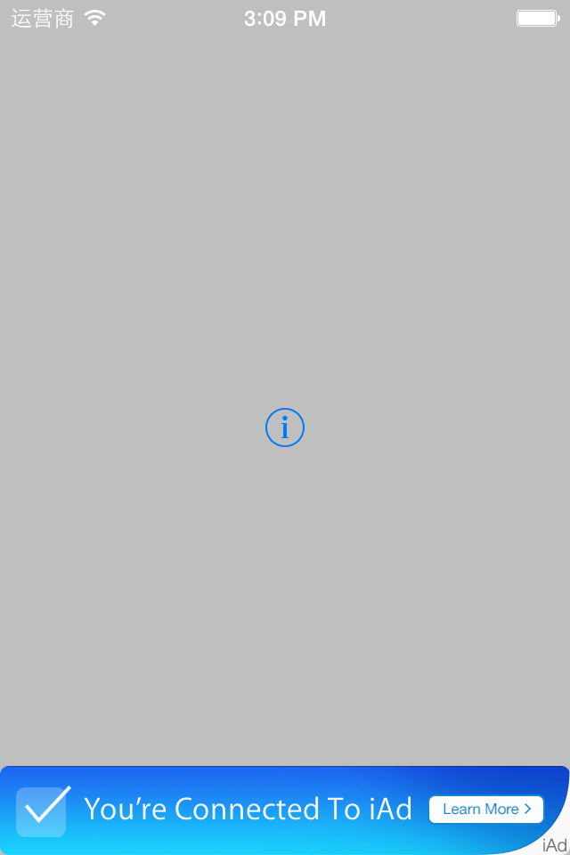
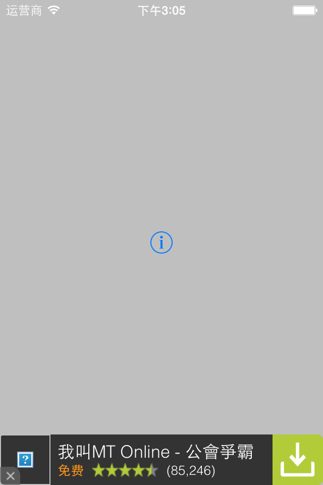
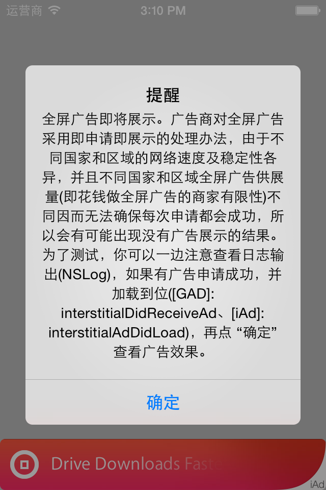
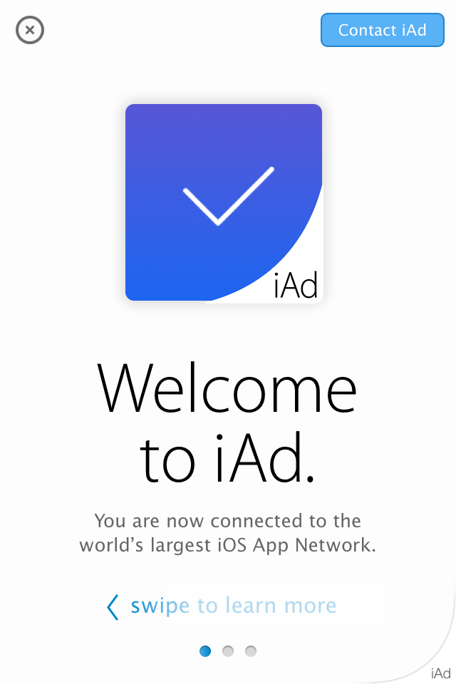

## iAd Google AdMob Ads Fusion Demo/苹果谷歌混合广告

This is a Demo for those who wanna use iAd in the right countries and AdMob out of the countries. [For iOS app only](https://github.com/Airfly/iAd-Google-AdMob-Ads-Fusion-Demo).

这是苹果谷歌混合广告项目示例。

这个仅仅是探讨如何最大化地让你的App广告带来最好的收入的思路。你需要理解广告是如何被投放的，而且你要学会在你的应用中设计广告的展示技巧。如果你的项目采用了iAd + AdMob 混合广告，那你要很清楚，iAd已经在哪里国家开通了。否则的在尚未开通iAd广告的国家展示iAd，是不会带来收入的，因为该国家或区域iAd广告库存量为0。这种情况，尽可能地切换到AdMob，并请求和展示AdMob广告。

### 本文示例的思路很简单：
* 1、有苹果广告的地方，优先演示苹果的广告，之后才演示谷歌广告；
* 2、同一广告商，多次请求失败时，切换到另外一家广告供应商，继续请求；
* 3、对于全屏广告，并不是请求结束就能演示广告的，通常要设置一个步骤（比如游戏过关）时请求，接着继续做该步骤上的处理，处理结束时（比如，查看游戏得分或排名）展示已经请求成功的全屏广告。

### Screen shot/屏幕截图

## License/许可

This code is distributed under the terms and conditions of the [MIT license](LICENSE).
本项目代码采用 [MIT license](LICENSE) 发布。

## Donate/捐赠

Your kind donations will help [me](https://github.com/Airfly) on my open source. If you like it you can buy me a drink, too. Thanks.

>Donate $1.00 USD
>
>

您的好意将会对我的开源代码有很大的帮助，如果您喜欢这些代码或是这些代码对您有用，我将会更加高兴，如果您买一支冰啤给我。感谢。我的支付宝帐号是：[1272000@163.com](http://alipay.com) 。当然您也可以使用PayPal操作：

>捐赠我1美元
>
>
